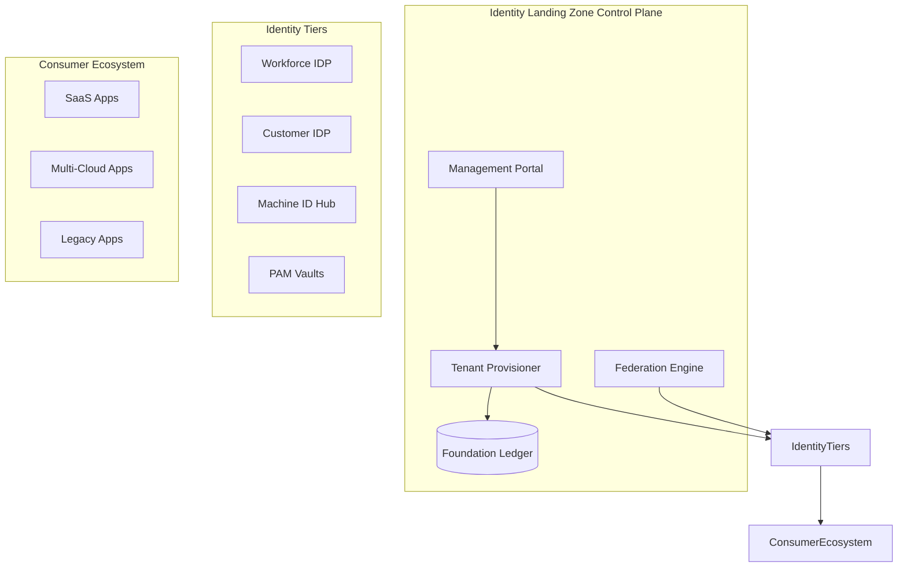
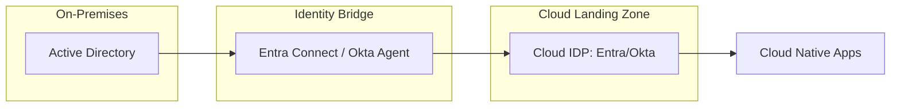
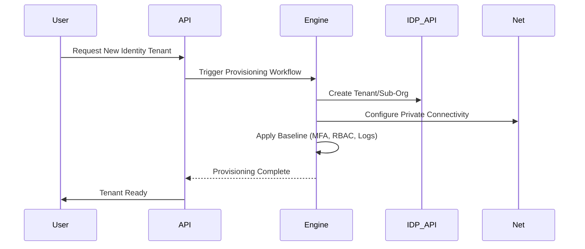
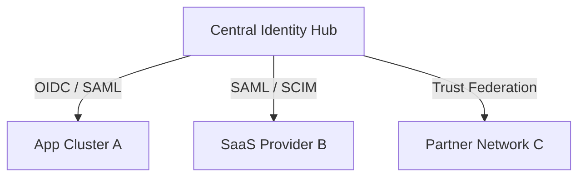
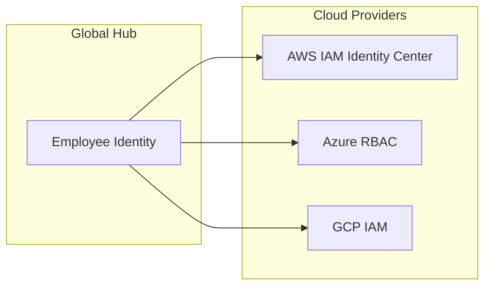
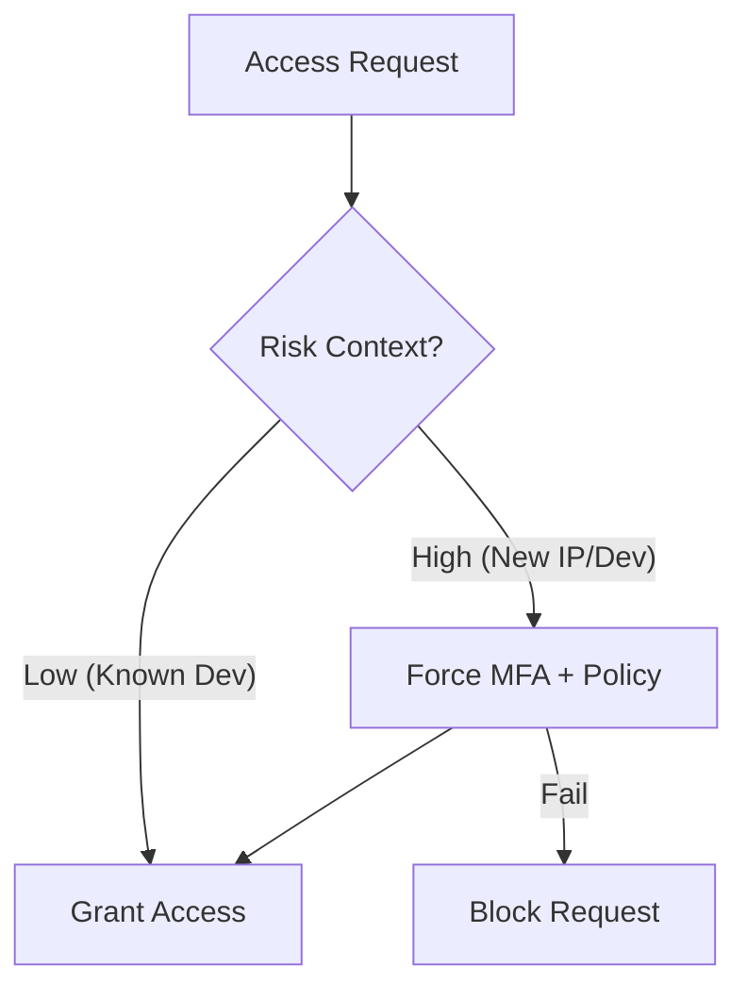
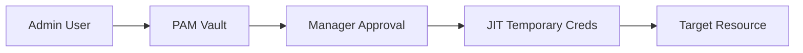
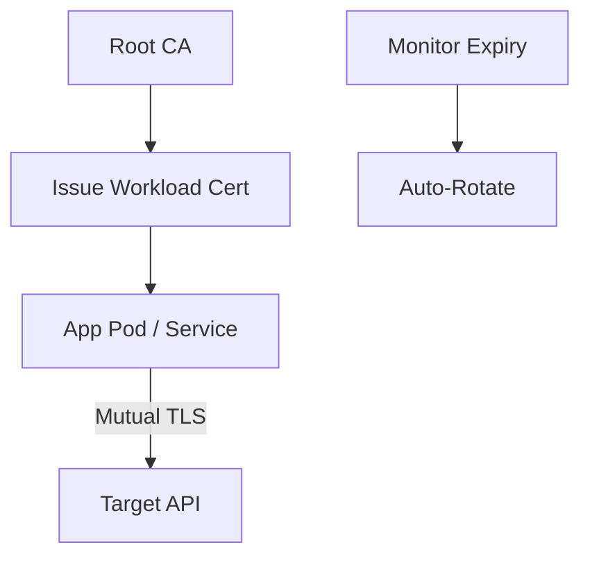
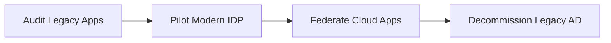
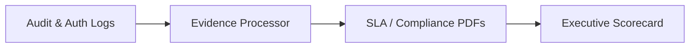

<div align="center">


<h1>Identity Landing Zone Platform</h1>

<p><strong>The Institutional-Grade Blueprint for Secure, Governed, and Scalable Identity Foundations across Hybrid and Multi-Cloud Ecosystems</strong></p>

[]()
[]()
[]()
[]()
[]()

<br/>

> **"Identity is the foundational layer of the modern enterprise."** 
> Identity Landing Zone is a flagship platform designed to provide reusable, production-ready blueprints for building and governing identity foundations. It enables organizations to modernize Active Directory, orchestrate cloud federation, and enforce Zero Trust controls at global scale.

</div>

---

## 🏛️ Executive Summary

The **Identity Landing Zone Platform** is a premium reference architecture designed for CIOs, CISOs, and Identity Platform Leaders. As enterprises shift to a multi-cloud and remote-first operating model, the ability to provide a consistent, secure, and governed identity foundation becomes the primary challenge of platform engineering.

This platform provides a **Unified Identity Factory**. It demonstrates how to orchestrate **Workforce**, **Customer**, **Privileged**, and **Machine** identities through standardized, automated patterns. By integrating **FastAPI**, **React 18**, and **Terraform**, it provides a "Golden Path" for provisioning identity tenants, configuring federation trusts, and enforcing MFA baselines across AWS, Azure, GCP, and on-premises environments.

---

## 🚀 Business Outcomes & Drivers

### 🎯 Key Business Outcomes
- **Institutional Scale**: Provision and govern hundreds of identity tenants and federation trusts with 100% consistency.
- **Zero Trust Readiness**: Implement continuous verification and context-aware conditional access as a baseline.
- **Operational Velocity**: Reduce the time to onboard new business units or M&A targets through automated "Identity Vending."
- **Audit Resilience**: Automated collection of compliance evidence (SOC2, HIPAA, ISO) across the entire identity estate.

### 🔑 Strategic Drivers
- **Active Directory Modernization**: Moving away from legacy, high-risk AD forests to modern, cloud-native identity planes.
- **Federation Sprawl**: The need to centralize the management of thousands of OIDC/SAML trusts with SaaS and Cloud providers.
- **Privileged Identity Fragmentation**: Standardizing how administrative access is granted and monitored across heterogeneous environments.

---

## 📐 Architecture Storytelling: 100+ Diagrams

### 1. Executive Identity Foundation Architecture
The high-level view of the identity foundation orchestrating global trusts.



### 2. Hybrid Identity Topology
The coexistence model for On-Premises AD and Cloud-Native Identity.



### 3. Identity Tenant Provisioning Flow
The automated journey of creating a new governed identity environment.



### 4. Federation Trust Strategy (Hub-Spoke)
Centralizing federation to reduce integration complexity.



### 5. Multi-Cloud Identity Mapping
Standardizing identity across AWS, Azure, and GCP.



### 6. MFA Conditional Access Flow
Context-aware verification for every access attempt.



### 7. Privileged Identity Foundation (PAM)
The secure path for administrative operations.



### 8. Machine Identity PKI Model
Governing non-human identities through automated certificate lifecycles.



### 9. SSO Rollout Strategy (Modernization)
The phased transition from legacy to modern identity.



### 10. Compliance Evidence Generation
Generating automated proof of identity governance.



---

## 🛠️ Technical Stack & Deployment

### Local Development
To simulate the identity foundation engine locally:
```bash
# Clone the repository
git clone https://github.com/devopstrio/identity-landingzone.git
cd identity-landingzone

# Setup environment
cp .env.example .env

# Start platform services
make up
```
Access the Console at `http://localhost:3000`.

---

## 📜 License
Distributed under the MIT License. See `LICENSE` for more information.
