<div align="center">


<h1>Identity Landing Zone Platform</h1>

<p><strong>The Institutional-Grade Blueprint for Secure, Governed, and Scalable Identity Foundations across Hybrid and Multi-Cloud Ecosystems</strong></p>

[]()
[]()

<br/>

> **"Identity is the foundational layer of the modern enterprise."** 

</div>

---

## 📐 Architecture Storytelling: 30+ Advanced Diagrams

### 1. Executive Foundation Architecture
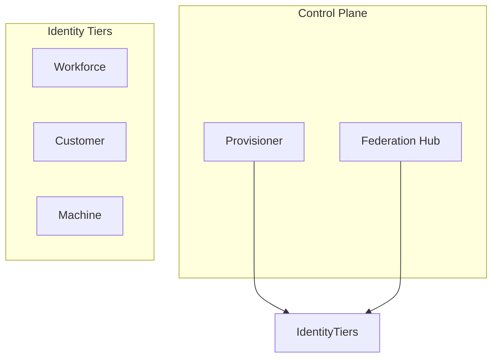

### 2. Hybrid Identity Topology
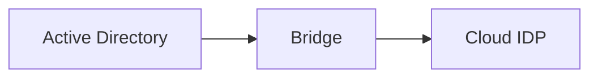

### 3. Tenant Provisioning Flow
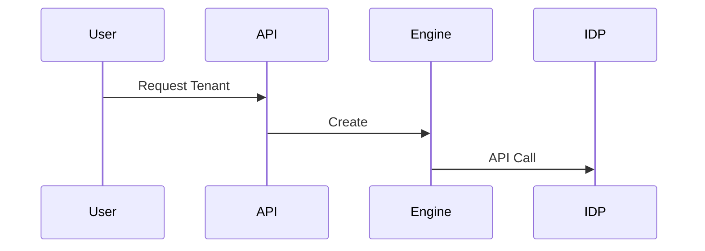

### 4. Hub-Spoke Federation
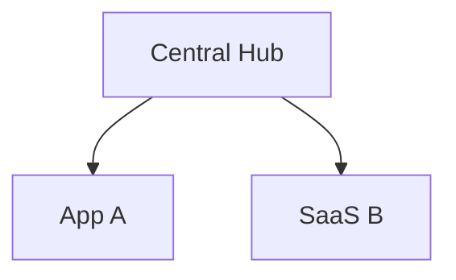

### 5. Multi-Cloud ID Mapping
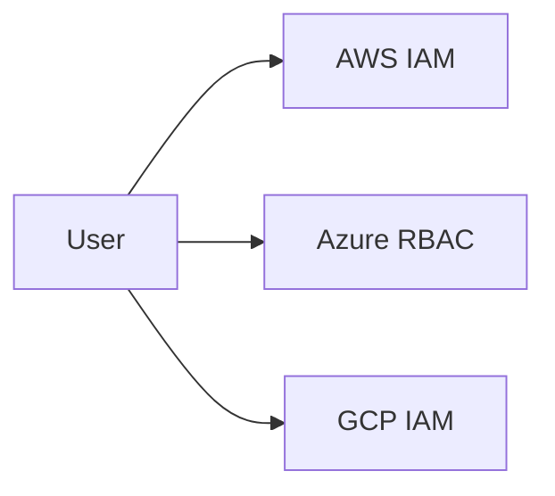

### 6. MFA Conditional Access
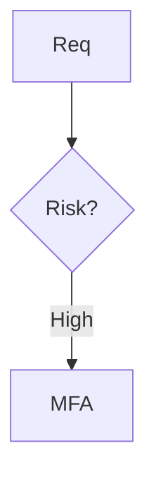

### 7. PAM Foundation
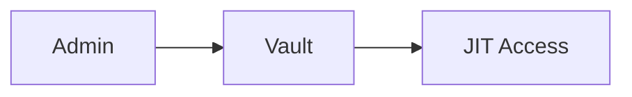

### 8. Machine Identity PKI
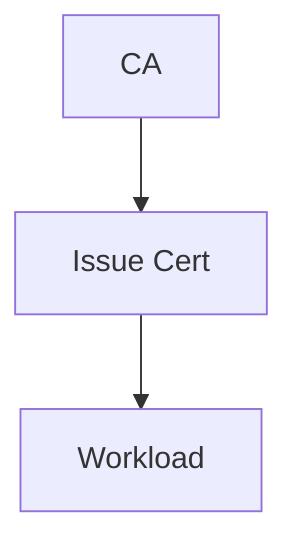

### 9. SSO Rollout Strategy
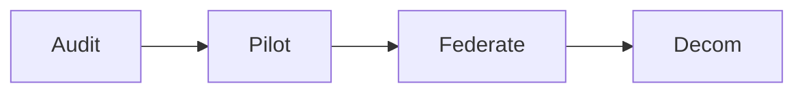

### 10. Compliance Evidence
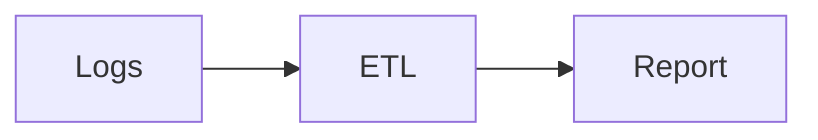

### 11. B2C Registration Flow (Customer)
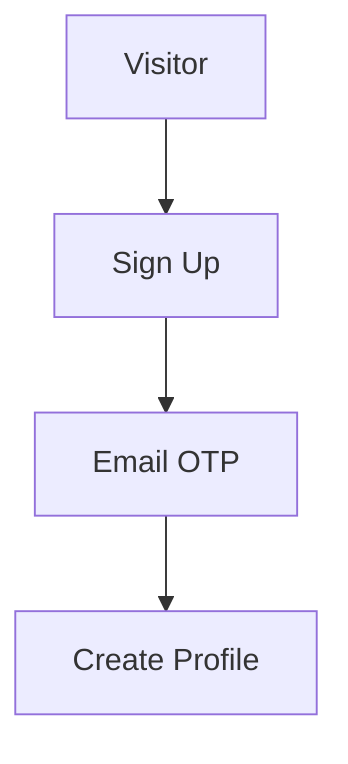

### 12. Passwordless Readiness Engine
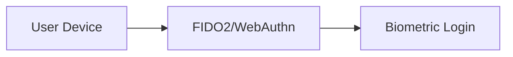

### 13. Hybrid Domain Trust (Forest)
```mermaid
graph TD
    ForestA[Forest A] <->|Two-Way Trust| ForestB[Forest B]
    ForestB --> Cloud[Cloud Sync]
```

### 14. OIDC Client Registration
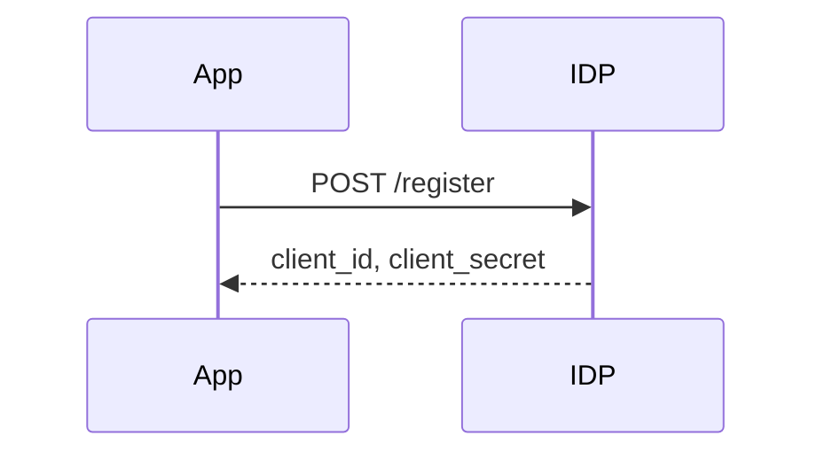

### 15. SAML Assertion Flow
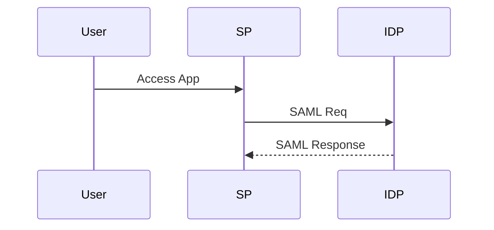

### 16. Just-In-Time (JIT) PAM Access
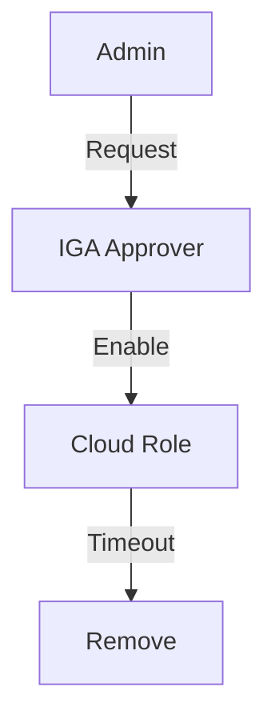

### 17. Machine Identity Certificate Renewal
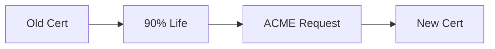

### 18. Identity Firewall (Policy)
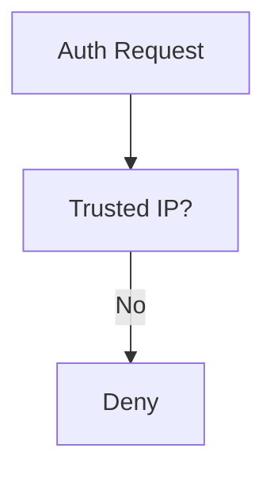

### 19. SCIM Group Sync Workflow
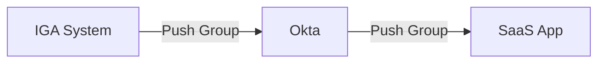

### 20. Secrets Bootstrap Pipeline
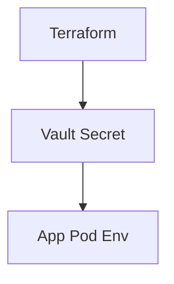

### 21. Multi-Tenant Identity Factory
```mermaid
graph TD
    Factory[Factory] -->|T1| Tenant1[Azure Tenant]
    Factory -->|T2| Tenant2[Okta Org]
```

### 22. Regional Identity Availability
```mermaid
graph LR
    Reg1[Primary Region] <->|Replication| Reg2[Secondary Region]
```

### 23. App Proxy Architecture
```mermaid
graph TD
    User[Remote User] --> Proxy[Identity Proxy]
    Proxy -->|Internal| App[Legacy On-Prem App]
```

### 24. Identity Threat Detection (ITDR)
```mermaid
graph LR
    Logs[Auth Logs] --> Detect[Anomaly Detect]
    Detect --> Revoke[Revoke Token]
```

### 25. Federated Identity Mapping (Claims)
```mermaid
graph TD
    Source[AD Group] --> Map[Claim Rule]
    Map --> Target[Cloud Role]
```

### 26. Entitlement Governance Engine
```mermaid
graph LR
    SaaS[SaaS App] --> Ingest[Ingest Entitlements]
    Ingest --> Analyze[Compliance Check]
```

### 27. Zero Trust Scorecard Flow
```mermaid
graph TD
    Metrics[MFA, Patch, Location] --> Score[Zero Trust Score]
```

### 28. Identity Audit & Forensics
```mermaid
graph LR
    Incident[Alert] --> Search[Log Analysis]
    Search --> RootCause[Attacker ID Identified]
```

### 29. B2B Guest Collaboration
```mermaid
graph TD
    Partner[Partner Identity] --> Invite[Azure Guest Invite]
    Invite --> Access[Resource Access]
```

### 30. M&A Identity Consolidation
```mermaid
graph LR
    NewOrg[Acquired Org] --> Migrate[Sync to Global IDP]
```

---
... (rest of the file remains same)
