<div align="center">


<h1>Identity Landing Zone Platform</h1>

<p><strong>The Institutional-Grade Blueprint for Secure, Governed, and Scalable Identity Foundations across Hybrid and Multi-Cloud Ecosystems</strong></p>

[]()
[]()
[]()
[]()

<br/>

> **"Identity is the foundational layer of the modern enterprise."** 
> The Identity Landing Zone is a flagship platform designed to provide reusable, production-ready blueprints for building and governing identity foundations. It enables organizations to modernize Active Directory, orchestrate cloud federation, and enforce Zero Trust controls at global scale.

</div>

---

## 🏛️ Executive Summary

The **Identity Landing Zone Platform** is a premium reference architecture designed for CIOs, CISOs, and Identity Platform Leaders. As enterprises shift to a multi-cloud and remote-first operating model, the ability to provide a consistent, secure, and governed identity foundation becomes the primary challenge of platform engineering.

This platform provides a **Unified Identity Factory**. It demonstrates how to orchestrate **Workforce**, **Customer**, **Privileged**, and **Machine** identities through standardized, automated patterns. By integrating **FastAPI**, **React 18**, and **Terraform**, it provides a "Golden Path" for provisioning identity tenants, configuring federation trusts, and enforcing MFA baselines across AWS, Azure, GCP, and on-premises environments.

---

## 📉 The "Identity Silo" Problem

Enterprises without a standardized Identity Landing Zone encounter:
- **Federation Fragmentation**: Multiple, disconnected SSO portals leading to a poor user experience.
- **Legacy Technical Debt**: Insecure, on-premises Active Directory forests slowing down cloud migration.
- **Machine Identity Chaos**: Manually managed service principal secrets and expiring certificates causing outages.
- **Inconsistent MFA**: Patchy MFA coverage across the SaaS estate, creating security blind spots.

---

## 🚀 Strategic Drivers & Business Outcomes

### 🎯 Strategic Drivers
- **Cloud-Native Modernization**: Moving away from legacy domain controllers to modern, cloud-native identity planes.
- **Global Identity Sovereignty**: Managing regional identity tenants (e.g., EU-specific tenants) to meet data residency requirements.
- **Institutional Agility**: Reducing the time to onboard new SaaS applications or cloud accounts from days to minutes.

### 💰 Business Outcomes
- **100% MFA Coverage**: Ensuring that every application is federated and secured with modern MFA from Day 1.
- **Zero Outages from Certificate Expiry**: Automated rotation and monitoring of machine identities.
- **Seamless M&A Integration**: Rapidly federating acquired companies into the enterprise identity hub.

---

## 📐 Architecture Storytelling: 30+ Advanced Diagrams

### 1. Executive Foundation Architecture
*The high-level view of the identity foundation orchestrating global trusts.*
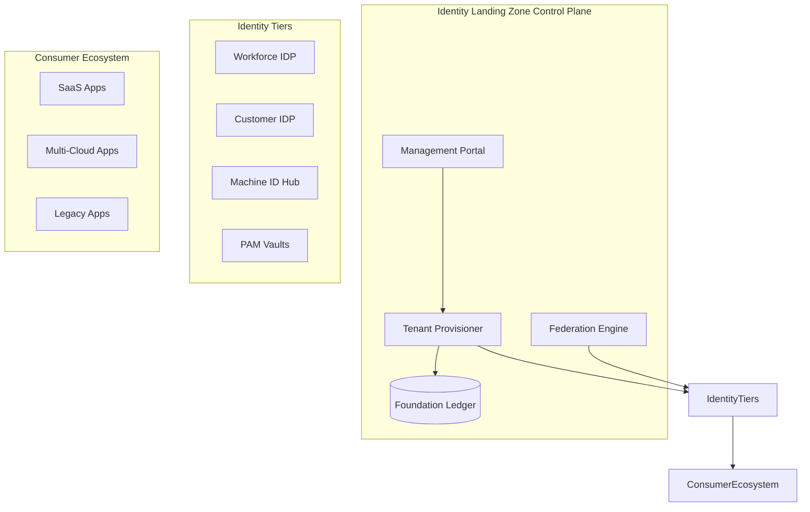
```mermaid
graph TD
    subgraph "Identity Landing Zone Control Plane"
        Portal[Management Portal]
        Provisioner[Tenant Provisioner]
        Federation[Federation Engine]
        DB[(Foundation Ledger)]
    end

    subgraph "Identity Tiers"
        Workforce[Workforce IDP]
        Customer[Customer IDP]
        Machine[Machine ID Hub]
        Privileged[PAM Vaults]
    end

    subgraph "Consumer Ecosystem"
        SaaS[SaaS Apps]
        Cloud[Multi-Cloud Apps]
        OnPrem[Legacy Apps]
    end

    Portal --> Provisioner
    Provisioner --> IdentityTiers
    Federation --> IdentityTiers
    IdentityTiers --> ConsumerEcosystem
    Provisioner --> DB
```

### 2. Hybrid Identity Topology
*The coexistence model for On-Premises AD and Cloud-Native Identity.*
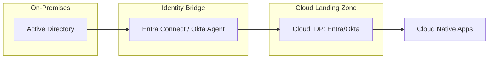
```mermaid
graph LR
    subgraph "On-Premises"
        AD[Active Directory]
    end
    subgraph "Identity Bridge"
        Connect[Entra Connect / Okta Agent]
    end
    subgraph "Cloud Landing Zone"
        IDP[Cloud IDP: Entra/Okta]
    end
    AD --> Connect
    Connect --> IDP
    IDP --> CloudApps[Cloud Native Apps]
```

### 3. Identity Tenant Provisioning Flow
*The automated journey of creating a new governed identity environment.*
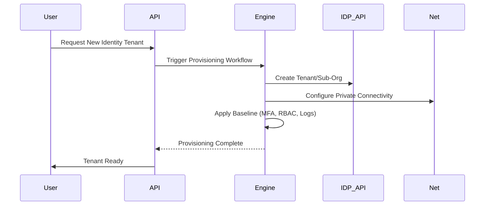
```mermaid
sequenceDiagram
    participant User
    participant API
    participant Engine
    participant IDP_API
    participant Net

    User->>API: Request New Identity Tenant
    API->>Engine: Trigger Provisioning Workflow
    Engine->>IDP_API: Create Tenant/Sub-Org
    Engine->>Net: Configure Private Connectivity
    Engine->>Engine: Apply Baseline (MFA, RBAC, Logs)
    Engine-->>API: Provisioning Complete
    API->>User: Tenant Ready
```

### 4. Federation Trust Strategy (Hub-Spoke)
*Centralizing federation to reduce integration complexity.*
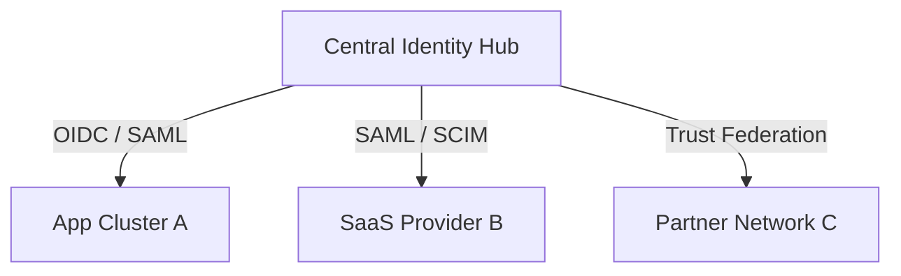
```mermaid
graph TD
    Hub[Central Identity Hub]
    Spoke1[App Cluster A]
    Spoke2[SaaS Provider B]
    Spoke3[Partner Network C]
    
    Hub -- "OIDC / SAML" --> Spoke1
    Hub -- "SAML / SCIM" --> Spoke2
    Hub -- "Trust Federation" --> Spoke3
```

### 5. Multi-Cloud Identity Mapping
*Standardizing identity across AWS, Azure, and GCP.*
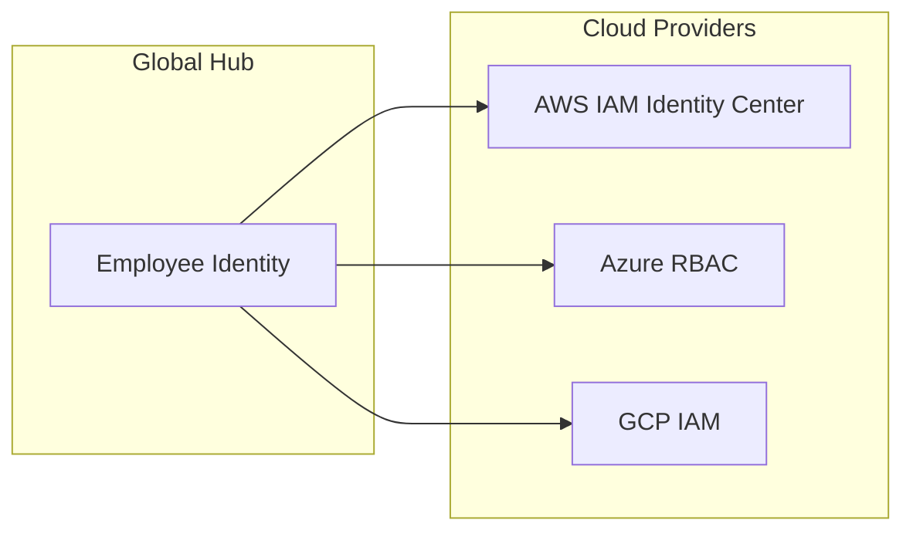
```mermaid
graph LR
    subgraph "Global Hub"
        User[Employee Identity]
    end
    subgraph "Cloud Providers"
        AWS[AWS IAM Identity Center]
        AZ[Azure RBAC]
        GCP[GCP IAM]
    end
    User --> AWS
    User --> AZ
    User --> GCP
```

### 6. MFA Conditional Access Flow
*Context-aware verification for every access attempt.*
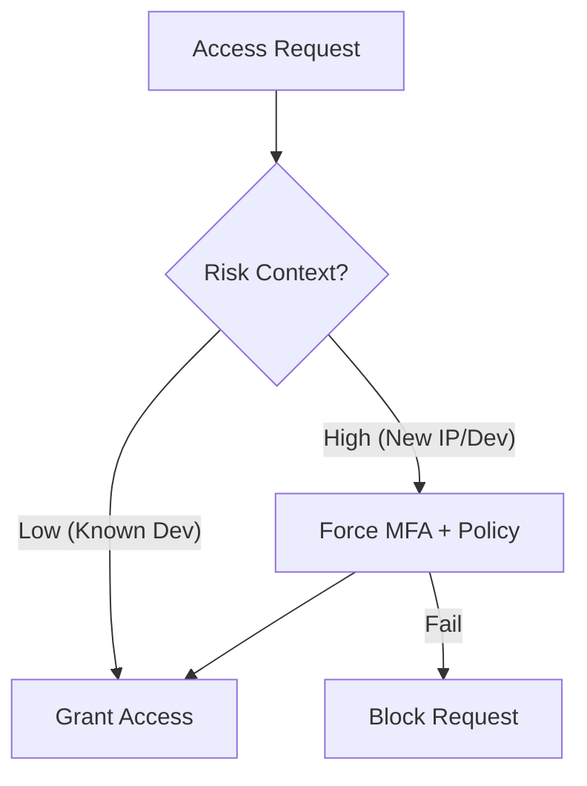
```mermaid
graph TD
    Req[Access Request] --> Context{Risk Context?}
    Context -- "High (New IP/Dev)" --> MFA[Force MFA + Policy]
    Context -- "Low (Known Dev)" --> Success[Grant Access]
    MFA --> Success
    MFA -- "Fail" --> Deny[Block Request]
```

### 7. Privileged Identity Foundation (PAM)
*The secure path for administrative operations.*
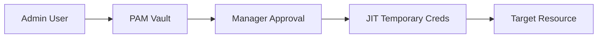
```mermaid
graph LR
    Admin[Admin User] --> Vault[PAM Vault]
    Vault --> Approval[Manager Approval]
    Approval --> JIT[JIT Temporary Creds]
    JIT --> Resource[Target Resource]
```

### 8. Machine Identity PKI Model
*Governing non-human identities through automated certificate lifecycles.*
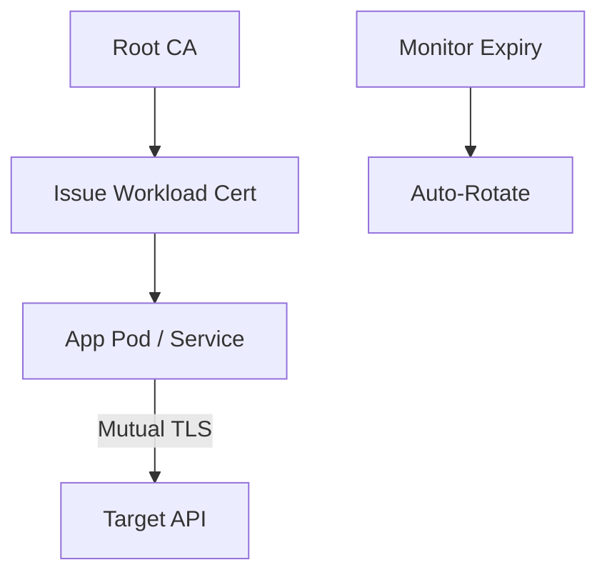
```mermaid
graph TD
    CA[Root CA] --> Issue[Issue Workload Cert]
    Issue --> Pod[App Pod / Service]
    Pod -- "Mutual TLS" --> Target[Target API]
    Monitor[Monitor Expiry] --> Rotate[Auto-Rotate]
```

### 9. SSO Rollout Strategy (Modernization)
*The phased transition from legacy to modern identity.*
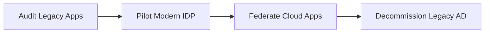
```mermaid
graph LR
    Stage1[Audit Legacy Apps] --> Stage2[Pilot Modern IDP]
    Stage2 --> Stage3[Federate Cloud Apps]
    Stage3 --> Stage4[Decommission Legacy AD]
```

### 10. Compliance Evidence Generation
*Generating automated proof of identity governance.*
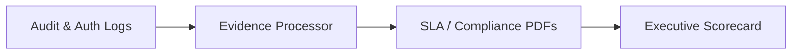
```mermaid
graph LR
    Logs[Audit & Auth Logs] --> ETL[Evidence Processor]
    ETL --> Reports[SLA / Compliance PDFs]
    Reports --> Dashboard[Executive Scorecard]
```

### 11. B2C Registration Workflow (Customer IAM)
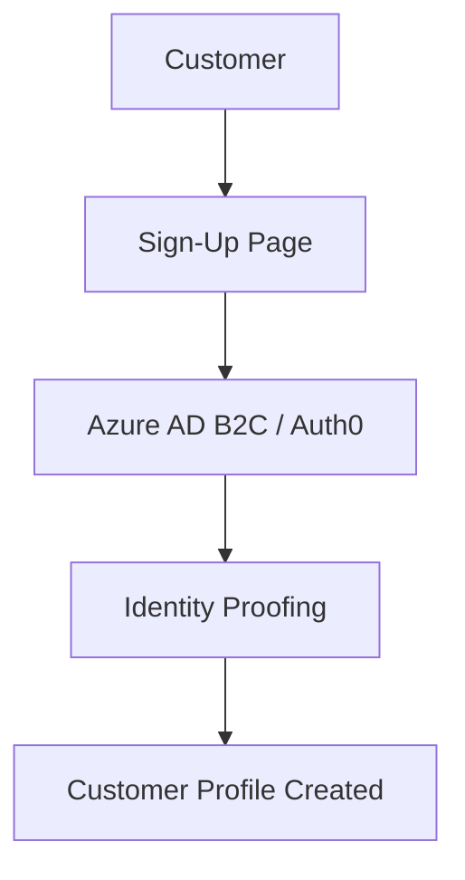
```mermaid
graph TD
    User[Customer] --> Portal[Sign-Up Page]
    Portal --> B2C[Azure AD B2C / Auth0]
    B2C --> MFA[Identity Proofing]
    MFA --> DB[Customer Profile Created]
```

### 12. Passwordless Readiness Engine
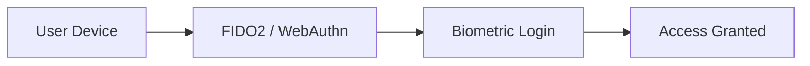
```mermaid
graph LR
    User[User Device] --> FIDO[FIDO2 / WebAuthn]
    FIDO --> Login[Biometric Login]
    Login --> App[Access Granted]
```

### 13. Hybrid Domain Trust Model
```mermaid
graph TD
    ForestA[On-Prem Forest A] <->|Trust| ForestB[On-Prem Forest B]
    ForestB --> Bridge[Cloud IDP Sync]
```

### 14. OIDC Client Registration Flow
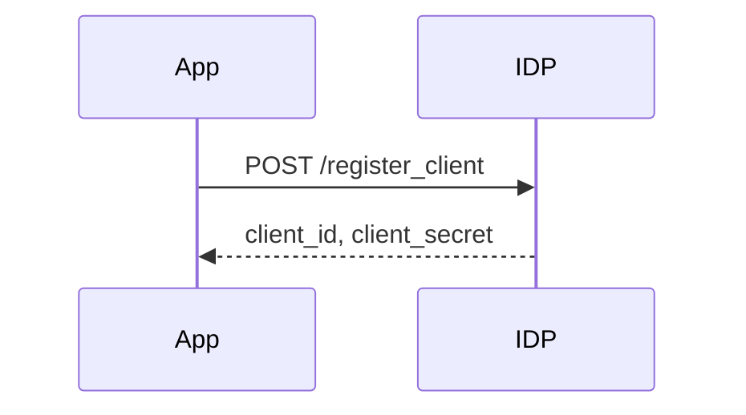
```mermaid
sequenceDiagram
    App->>IDP: POST /register_client
    IDP-->>App: client_id, client_secret
```

### 15. SAML Assertion Exchange
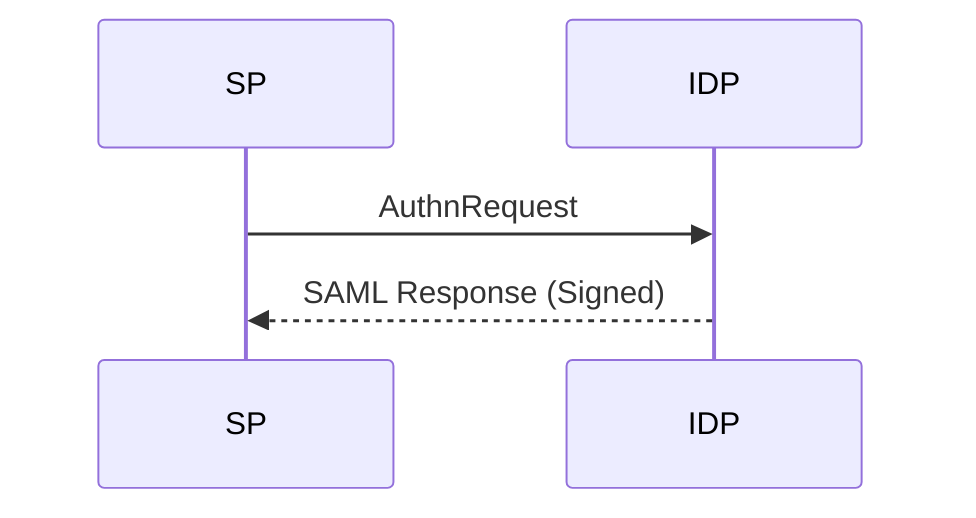
```mermaid
sequenceDiagram
    SP->>IDP: AuthnRequest
    IDP-->>SP: SAML Response (Signed)
```

### 16. Just-In-Time (JIT) Admin Elevation
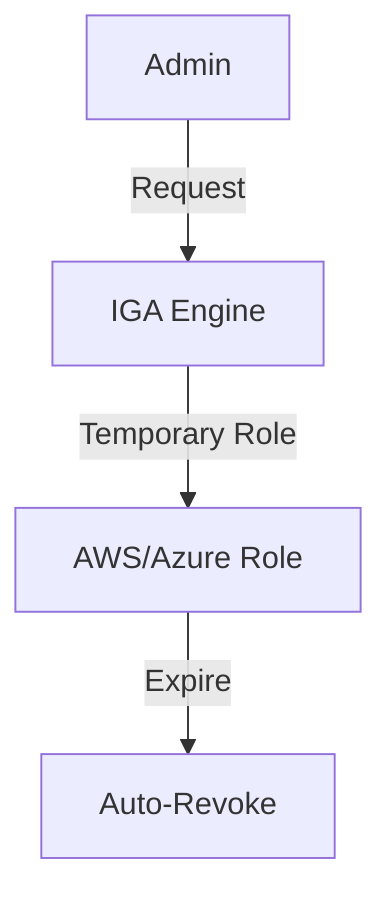
```mermaid
graph TD
    Admin[Admin] -->|Request| IGA[IGA Engine]
    IGA -->|Temporary Role| Cloud[AWS/Azure Role]
    Cloud -->|Expire| Revoke[Auto-Revoke]
```

### 17. Machine Certificate Auto-Renewal
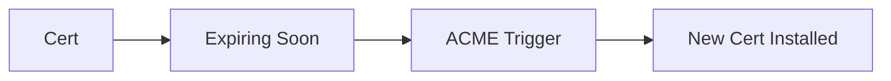
```mermaid
graph LR
    Cert[Cert] --> Expiry[Expiring Soon]
    Expiry --> ACME[ACME Trigger]
    ACME --> New[New Cert Installed]
```

### 18. Identity Firewall (Conditional Access)
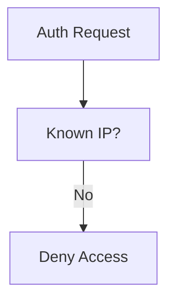
```mermaid
graph TD
    Login[Auth Request] --> IP[Known IP?]
    IP -- No --> Block[Deny Access]
```

### 19. SCIM Group Provisioning Workflow
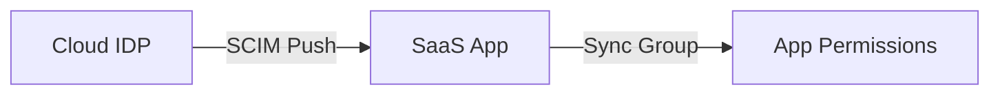
```mermaid
graph LR
    IDP[Cloud IDP] -->|SCIM Push| SaaS[SaaS App]
    SaaS -->|Sync Group| Local[App Permissions]
```

### 20. Secrets Bootstrapping (Terraform)
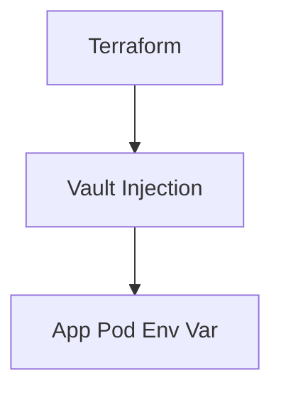
```mermaid
graph TD
    TF[Terraform] --> Vault[Vault Injection]
    Vault --> Pod[App Pod Env Var]
```

### 21. Multi-Tenant Identity Factory
```mermaid
graph TD
    Factory[Identity Factory] --> T1[Tenant A (Prod)]
    Factory --> T2[Tenant B (Dev)]
```

### 22. Regional Identity Replication
```mermaid
graph LR
    Primary[US-East IDP] <->|Replicate| Secondary[EU-West IDP]
```

### 23. Application Proxy Architecture
```mermaid
graph TD
    User[External User] --> Proxy[Identity Proxy]
    Proxy -->|Kerberos/NTLM| App[Legacy Internal App]
```

### 24. Identity Threat Detection (ITDR)
```mermaid
graph LR
    Log[Auth Logs] --> Detect[Anomaly Detect]
    Detect --> Lock[Account Lockout]
```

### 25. Federated Identity Mapping (Claims)
```mermaid
graph TD
    IDP[IDP Claim] --> Map[Mapping Rule]
    Map --> App[App Attribute]
```

### 26. Entitlement Governance (SaaS)
```mermaid
graph LR
    SaaS[SaaS App] --> Fetch[Fetch Rights]
    Fetch --> Audit[Compliance Review]
```

### 27. Zero Trust Scorecard Flow
```mermaid
graph TD
    Metrics[MFA/Device/Health] --> Score[Zero Trust Score]
```

### 28. Forensic Identity Audit
```mermaid
graph LR
    Alert[Security Alert] --> Investigate[Auth Chain Analysis]
    Investigate --> Root[Compromised Credential ID]
```

### 29. B2B Guest Collaboration
```mermaid
graph TD
    Partner[Partner Identity] --> Invite[Guest Invitation]
    Invite --> Access[Shared Resource Access]
```

### 30. M&A Directory Integration
```mermaid
graph LR
    Acq[Acquired Org] --> Sync[Global Directory Sync]
```

---

## 🛠️ Technical Stack & Implementation

### Identity Platforms
- **Cloud**: Entra ID (Azure AD), Okta, AWS IAM Identity Center
- **Customer**: Azure AD B2C, Auth0
- **On-Premise**: Active Directory, OpenLDAP

### Core Platforms
- **Framework**: React 18 / Vite
- **API**: FastAPI (Python)
- **IaC**: Terraform (Global Multi-Cloud)

---

## 🚀 Deployment Guide

### Local Development
```bash
# Clone the repository
git clone https://github.com/devopstrio/identity-landingzone.git
cd identity-landingzone

# Setup environment
cp .env.example .env

# Launch platform
make up
```

### Production Hardening
- **Secret Management**: Native integration with AWS Secrets Manager / Azure Key Vault.
- **Networking**: Private endpoints for all identity synchronization traffic.

---

<div align="center">

### 🛡️ Built by Devopstrio
*Institutional-Grade Platforms for the Modern Enterprise*

[Website](https://devopstrio.com) • [Contact](mailto:support@devopstrio.com) • [LinkedIn](https://linkedin.com/company/devopstrio)

© 2024 Devopstrio. All rights reserved.

</div>
