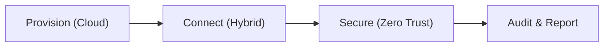
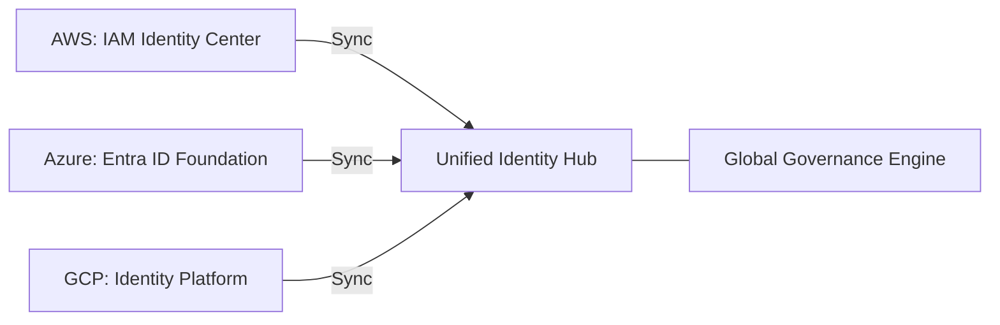
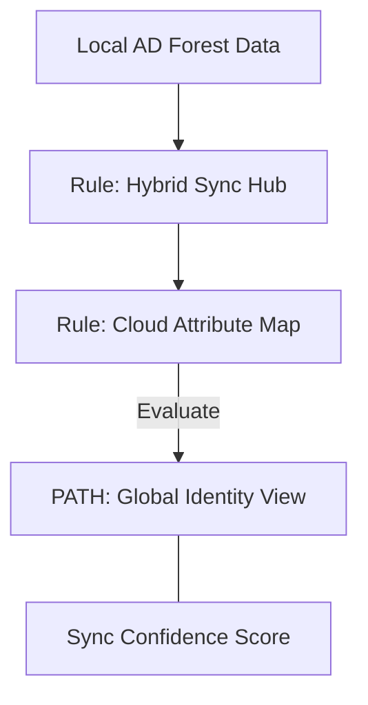
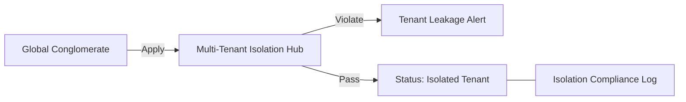
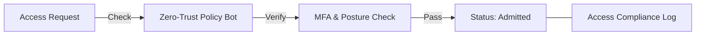
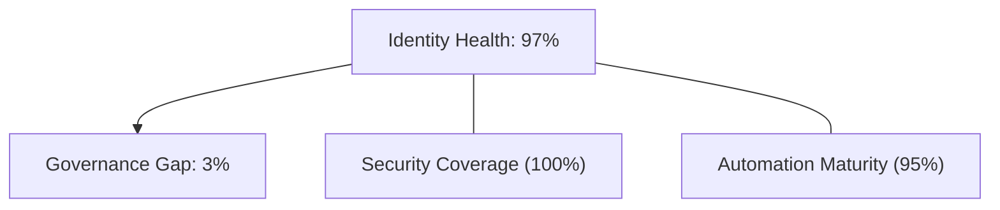
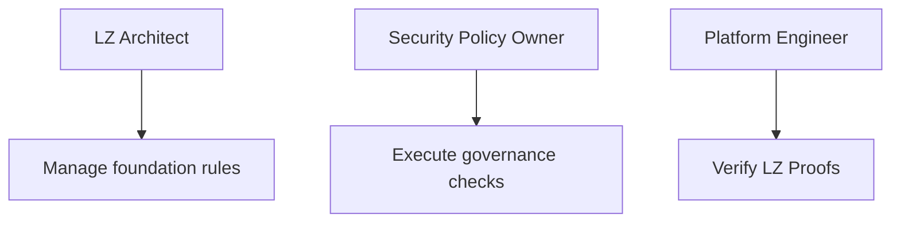
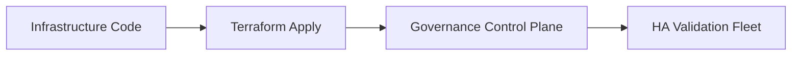
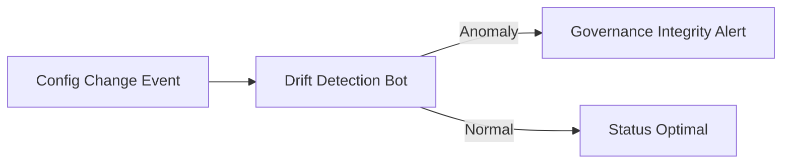
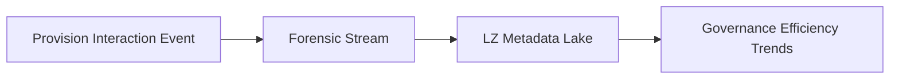

<div align="center">


<h1>Identity Landing Zone</h1>

<p><strong>The Institutional-Grade Platform for Secure, Governed, and Scalable Identity Foundations across Hybrid and Multi-Cloud Ecosystems.</strong></p>

[]()
[]()
[]()

<br/>

> **"Identity is the foundational layer of the modern enterprise."** 
> **Identity Landing Zone** is an enterprise-grade platform designed to provide a secure, measurable, and highly automated foundation for global identity operations. It orchestrates the complex lifecycle of identity infrastructure—from multi-cloud tenant provisioning and hybrid synchronization to distributed tenant governance and unified identity lifecycle auditing.

</div>

---

## 🏛️ Executive Summary

Fragmented identity silos and manual tenant provisioning are strategic operational liabilities; lack of centralized identity orchestration is a primary barrier to organizational cloud-native maturity. Organizations fail to maintain a secure identity foundation not because of a lack of directories, but because of fragmented landing zone standards, lack of automated synchronization validation, and an inability to orchestrate identity landing zones with operational precision.

This platform provides the **Identity Governance Intelligence Plane**. It implements a complete **Enterprise Identity-as-Code Framework**, enabling Security and Platform teams to manage global identity foundations as first-class citizens. By automating the identification of configuration drifts through real-time telemetry analysis and orchestrating the provisioning of governed multi-cloud tenants, we ensure that every organizational identity—from core directory admins to routine application users—is secured by default, audited for history, and strictly aligned with institutional identity frameworks.

---

## 📐 Architecture Storytelling: Principal Reference Models

### 1. Principal Architecture: Global Identity Landing Zone & Governance Intelligence Plane
This diagram illustrates the end-to-end flow from multi-cloud tenant provisioning and hybrid sync to distributed governance, Zero-Trust enforcement, and institutional LZ auditing.


```mermaid
graph LR
    %% Subgraph Definitions
    subgraph IdentityIngress["Identity & Foundation Ingress"]
        direction TB
        OnPrem_AD["On-Prem Active Directory"]
        Cloud_IdPs["Entra ID / Okta / Ping / GCP"]
        Machine_Identities["Workload & SPIFFE Identities"]
    end

    subgraph IntelligenceEngine["Governance Intelligence Hub"]
        direction TB
        API["FastAPI Governance Gateway"]
        TenantProvisioner["Multi-Cloud Tenant Orch"]
        SyncOrch["Hybrid Connectivity & Sync Hub"]
        GovernanceHub["Identity Posture & Score Hub"]
    end

    subgraph OperationsPlane["Distributed LZ Fleet"]
        direction TB
        SyncWorkers["Identity Sync & Replication Fleet"]
        DriftDetectors["AIOps Config Pattern Scanners"]
        GatekeeperProxies["Zero-Trust Access Proxies"]
    end

    subgraph OperationsHub["Institutional LZ Hub"]
        direction TB
        Scorecard["LZ Maturity Scorecard"]
        Analytics["Sync & Automation Stats"]
        Audit["Forensic LZ Metadata Lake"]
    end

    subgraph DevOps["Landing-Zone-as-Code Framework"]
        direction TB
        TF["Terraform Identity Modules"]
        ShadowAdminBot["Privilege Drift Validator"]
        ChatOps["LZ Governance Hub"]
    end

    %% Flow Arrows
    IdentityIngress -->|1. Submit Identity Request| API
    API -->|2. Provision Tenant| TenantProvisioner
    TenantProvisioner -->|3. Sync Hybrid Identity| SyncOrch
    SyncOrch -->|4. Assess Governance| GovernanceHub
    
    GovernanceHub -->|5. Execute Enforcement| OperationsPlane
    OperationsPlane -->|6. Notify Status| ChatOps
    API -->|7. Visualize Health| Scorecard
    
    Scorecard -->|8. Track Maturity| Analytics
    Scorecard -->|9. Record Provision| Audit
    
    TF -->|10. Provision Backbone| IntelligenceEngine
    ShadowAdminBot -->|11. Inject Privilege Risk| TenantProvisioner
    Audit -->|12. Improve LZ| SyncWorkers

    %% Styling
    classDef ingress fill:#f5f5f5,stroke:#616161,stroke-width:2px;
    classDef intel fill:#e8eaf6,stroke:#1a237e,stroke-width:2px;
    classDef operations fill:#e1f5fe,stroke:#01579b,stroke-width:2px;
    classDef ops fill:#ede7f6,stroke:#311b92,stroke-width:2px;
    classDef devops fill:#e8f5e9,stroke:#1b5e20,stroke-width:2px;

    class IdentityIngress ingress;
    class IntelligenceEngine intel;
    class OperationsPlane operations;
    class OperationsHub ops;
    class DevOps devops;
```

### 2. The Identity LZ Lifecycle Flow
The continuous path of an identity landing zone from initial provision (cloud) and hybrid connection to active Zero-Trust security, governance (scorecard), and institutional forensic auditing.


```mermaid
graph LR
    Provision["Provision (Cloud)"] --> Connect["Connect (Hybrid)"]
    Connect --> Secure["Secure (Zero Trust)"]
    Secure --> Audit["Audit & Report"]
```

### 3. Distributed Multi-Cloud Identity Landing Zone Topology
Strategically orchestrating identity infrastructure across global environments (AWS, Azure, GCP, and SaaS), providing a unified institutional view of global identity health and LZ readiness.


```mermaid
graph LR
    AWS["AWS: IAM Identity Center"] -->|Sync| Hub["Unified Identity Hub"]
    Azure["Azure: Entra ID Foundation"] -->|Sync| Hub
    GCP["GCP: Identity Platform"] -->|Sync| Hub
    Hub --- Logic["Global Governance Engine"]
```

### 4. Hybrid Identity Connectivity & Sync Flow
Executing complex logic for securing the bridge between on-premises Active Directory and Cloud-native IdPs, ensuring every organizational identity is synchronized and verified against institutional standards.


```mermaid
graph TD
    Local["Local AD Forest Data"] --> Bridge["Rule: Hybrid Sync Hub"]
    Bridge --> Cloud["Rule: Cloud Attribute Map"]
    Cloud -->|Evaluate| Context["PATH: Global Identity View"]
    Context --- Estimate["Sync Confidence Score"]
```

### 5. Multi-Tenant Governance & Isolation Flow
Automatically managing identity isolation and cross-tenant synchronization for global conglomerates, ensuring institutional data residency and security boundaries by default.


```mermaid
graph LR
    Org["Global Conglomerate"] -->|Apply| Guard["Multi-Tenant Isolation Hub"]
    Guard -->|Violate| Alert["Tenant Leakage Alert"]
    Guard -->|Pass| Verify["Status: Isolated Tenant"]
    Verify --- Audit["Isolation Compliance Log"]
```

### 6. Zero-Trust Access & Conditional Gatekeeper Flow
Managing the lifecycle of an access request, automatically enforcing institutional security baselines at the LZ entry point for all identities, ensuring zero-latency security confidence.


```mermaid
graph LR
    Request["Access Request"] -->|Check| Gatekeeper["Zero-Trust Policy Bot"]
    Gatekeeper -->|Verify| Auth["MFA & Posture Check"]
    Auth -->|Pass| Admit["Status: Admitted"]
    Admit --- Audit["Access Compliance Log"]
```

### 7. Institutional Identity Maturity Scorecard
Grading organizational performance based on key indicators: Security Coverage, Automation Maturity, and Compliance Adherence Index.


```mermaid
graph TD
    Post["Identity Health: 97%"] --> Risk["Governance Gap: 3%"]
    Post --- C1["Security Coverage (100%)"]
    Post --- C2["Automation Maturity (95%)"]
```

### 8. Identity & RBAC for LZ Governance
Managing fine-grained access to landing zone hubs, synchronization workers, and audit logs between LZ Architects, Security Policy Owners, and Platform Engineers.


```mermaid
graph TD
    Architect["LZ Architect"] --> Hub["Manage foundation rules"]
    Owner["Security Policy Owner"] --> Exec["Execute governance checks"]
    Engineer["Platform Engineer"] --> Audit["Verify LZ Proofs"]
```

### 9. IaC Deployment: Landing-Zone-as-Code Framework
Using modular Terraform to deploy and manage the versioned distribution of the identity tracking hubs, governance workers, and forensic metadata lakes.


```mermaid
graph LR
    HCL["Infrastructure Code"] --> TF["Terraform Apply"]
    TF --> Engine["Governance Control Plane"]
    Engine --> Clusters["HA Validation Fleet"]
```

### 10. AIOps Identity Drift & Compliance Validation Flow
Using advanced analytics to identify sudden surges in shadow admins, suspicious configuration drifts, or unusual tenant pattern changes that could result in institutional risk.


```mermaid
graph LR
    Drift["Config Change Event"] --> Analyzer["Drift Detection Bot"]
    Analyzer -->|Anomaly| Alert["Governance Integrity Alert"]
    Analyzer -->|Normal| Pass["Status Optimal"]
```

### 11. Metadata Lake for Forensic LZ Audit
Storing long-term records of every LZ provisioned, every configuration change recorded, and every identity sync event for institutional record-keeping, compliance auditing, and post-provisioning forensics.


```mermaid
graph LR
    Provision["Provision Interaction Event"] --> Stream["Forensic Stream"]
    Stream --> Lake["LZ Metadata Lake"]
    Lake --> Trends["Governance Efficiency Trends"]
```

---

## 🏛️ Core Governance Pillars

1.  **Unified Foundation Coordination**: Maximizing resilience by centralizing all identity measurement through a single institutional plane.
2.  **Automated Tenant Provisioning**: Eliminating "manual silo" scenarios through proactive orchestration and pattern verification.
3.  **Sequential Synchronization Intelligence**: Ensuring zero-interruption operations through dependency-aware multi-cloud replication.
4.  **Zero-Trust LZ Protection**: Automatically enforcing identity-based access and rule evaluation across all LZ tiers.
5.  **Autonomous Governance Logic**: Guaranteeing reliability through automated industry-specific identity monitoring runbooks.
6.  **Full LZ Auditability**: Immutable recording of every tenant provision and configuration change for institutional forensics.

---

## 🛠️ Technical Stack & Implementation

### Governance Engine & APIs
*   **Framework**: Python 3.11+ / FastAPI.
*   **Tenant Engine**: Custom Python-based logic for multi-cloud IdP provisioning and DORA-style identity metrics.
*   **Integrations**: Native connectors for Entra ID, Okta, Ping, and Cloud IAM APIs.
*   **Persistence**: PostgreSQL (Governance Ledger) and Redis (Live LZ State).
*   **Auth Orchestrator**: Federated OIDC/SAML for least-privilege identity management access.

### Governance Dashboard (UI)
*   **Framework**: React 18 / Vite.
*   **Theme**: Dark, Blue, Indigo (Modern high-fidelity foundation aesthetic).
*   **Visualization**: D3.js for identity topologies and Recharts for governance velocity analytics.

### Infrastructure & DevOps
*   **Runtime**: AWS EKS or Azure Kubernetes Service (AKS) for management plane.
*   **Governance Hub**: Managed event sourcing for immutable identity security timeline reconstruction.
*   **IaC**: Modular Terraform for deploying the identity landing zone and validation fleet.

---

## 🏗️ IaC Mapping (Module Structure)

| Module | Purpose | Real Services |
| :--- | :--- | :--- |
| **`infrastructure/idp_hub`** | Central management plane | EKS, PostgreSQL, Redis |
| **`infrastructure/tenants`** | Distributed LZ provisioners | K8s Workers, Cloud APIs |
| **`infrastructure/connectors`** | Multi-Cloud Sync Hubs | Webhooks, Lambda |
| **`infrastructure/auditing`** | Forensic LZ sinks | S3, Athena, Quicksight |

---

## 🚀 Deployment Guide

### Local Principal Environment
```bash
# Clone the landing zone platform
git clone https://github.com/devopstrio/identity-landingzone.git
cd identity-landingzone

# Configure environment
cp .env.example .env

# Launch the Landing Zone stack
make init

# Trigger a mock tenant provisioning and automated identity sync simulation
make simulate-lz
```

Access the Management Portal at `http://localhost:3000`.

---

## 📜 License
Distributed under the MIT License. See `LICENSE` for more information.

---
<div align="center">
  <p>© 2026 Devopstrio. All rights reserved.</p>
</div>
