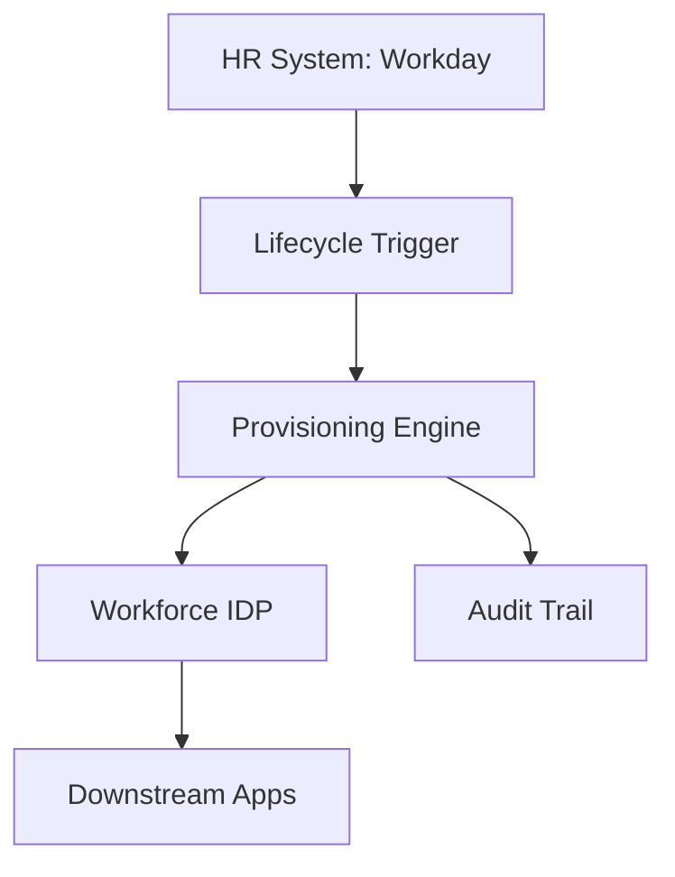
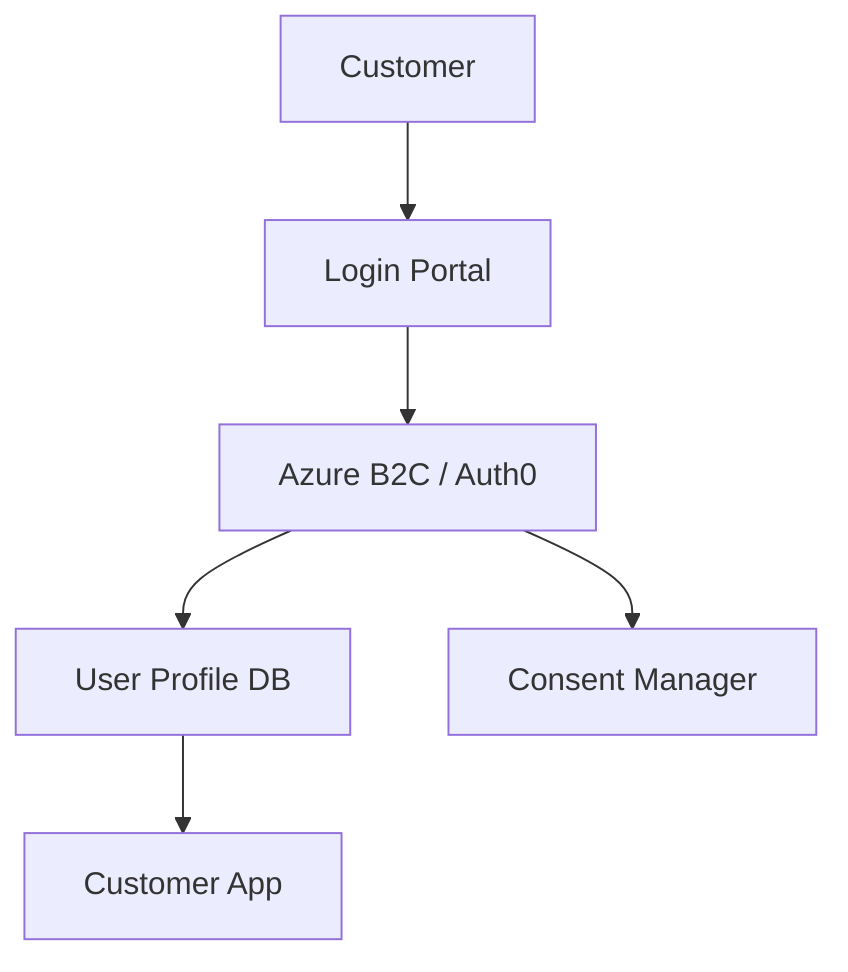
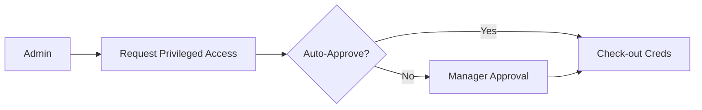

# Identity Foundation Diagrams

## 11. Workforce Identity Model
*Standardized workforce lifecycle integration.*

```mermaid
graph TD
    HR[HR System: Workday] --> Trigger[Lifecycle Trigger]
    Trigger --> Engine[Provisioning Engine]
    Engine --> IDP[Workforce IDP]
    IDP --> Apps[Downstream Apps]
    Engine --> Audit[Audit Trail]
```

## 12. Customer Identity Model (CIAM)

```mermaid
graph TD
    User[Customer] --> Portal[Login Portal]
    Portal --> B2C[Azure B2C / Auth0]
    B2C --> Profile[User Profile DB]
    B2C --> Consent[Consent Manager]
    Profile --> App[Customer App]
```

## 13. PAM Foundation Model

```mermaid
graph LR
    Admin[Admin] --> Request[Request Privileged Access]
    Request --> Approve{Auto-Approve?}
    Approve -- "Yes" --> Vault[Check-out Creds]
    Approve -- "No" --> Manager[Manager Approval]
    Manager --> Vault
```
