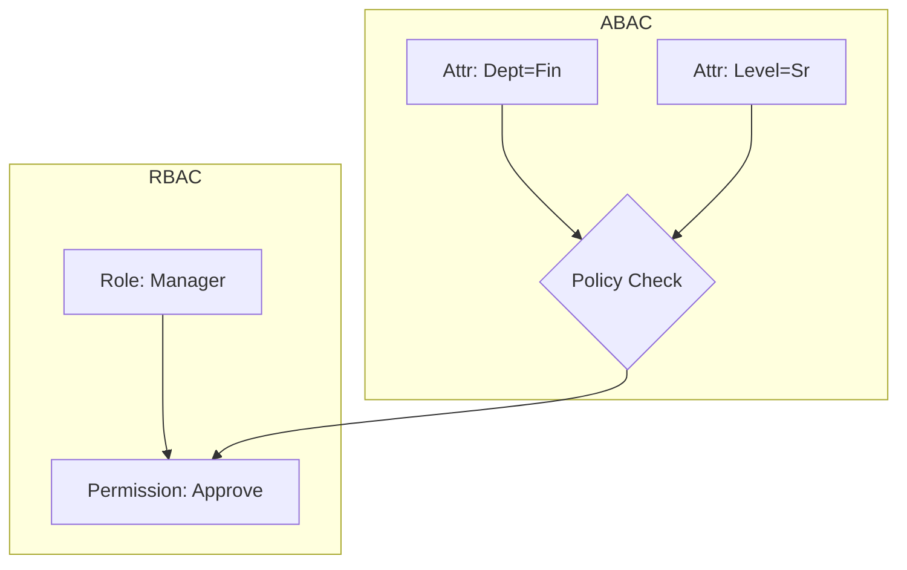
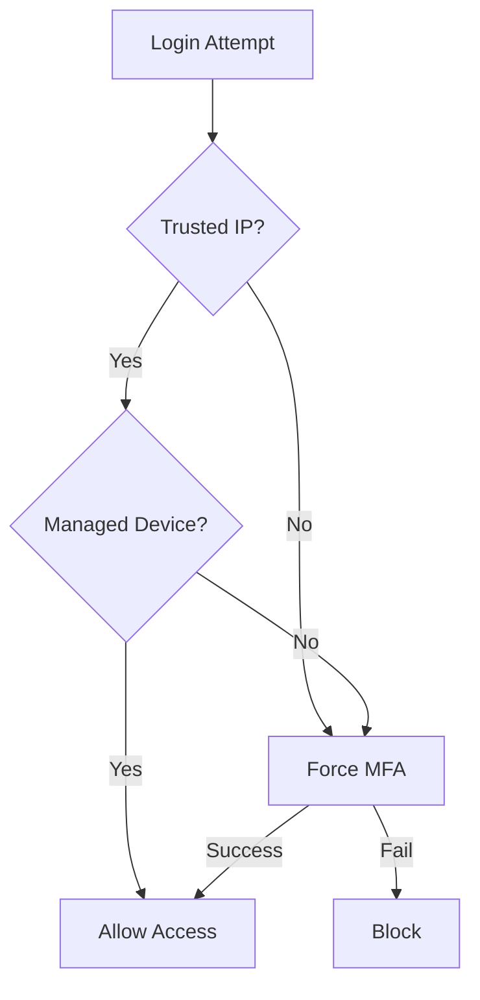
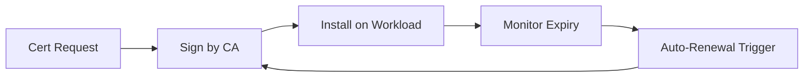

# Federation & Security Diagrams

## 22. RBAC vs ABAC Model
*Comparing role-based and attribute-based access.*

```mermaid
graph TD
    subgraph "RBAC"
        R[Role: Manager] --> P[Permission: Approve]
    end
    subgraph "ABAC"
        A[Attr: Dept=Fin] --> C{Policy Check}
        U[Attr: Level=Sr] --> C
        C --> P
    end
```

## 25. MFA Decision Flow (Conditional Access)

```mermaid
graph TD
    Login[Login Attempt] --> IP{Trusted IP?}
    IP -- "No" --> MFA[Force MFA]
    IP -- "Yes" --> Device{Managed Device?}
    Device -- "No" --> MFA
    Device -- "Yes" --> Success[Allow Access]
    MFA -- "Success" --> Success
    MFA -- "Fail" --> Block[Block]
```

## 40. Certificate Lifecycle Flow

```mermaid
graph LR
    Req[Cert Request] --> Sign[Sign by CA]
    Sign --> Deploy[Install on Workload]
    Deploy --> Monitor[Monitor Expiry]
    Monitor --> Renew[Auto-Renewal Trigger]
    Renew --> Sign
```
